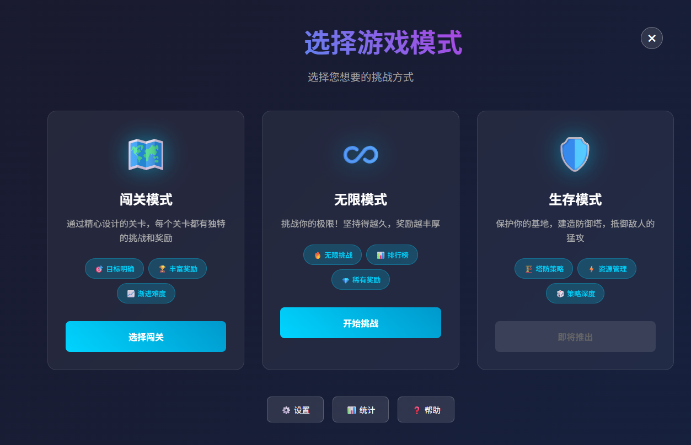
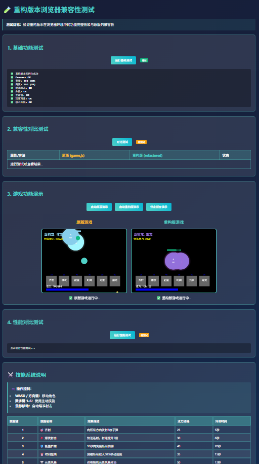
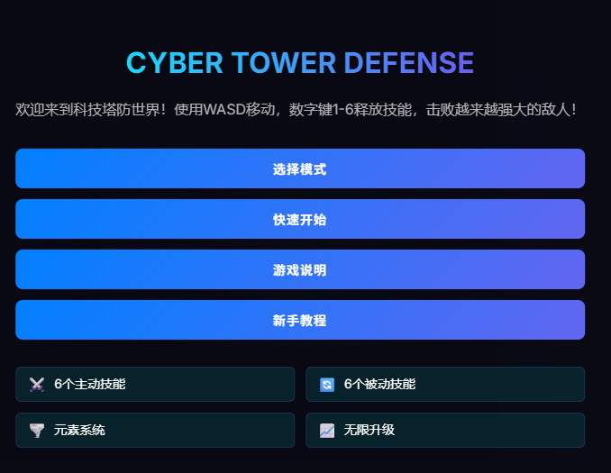
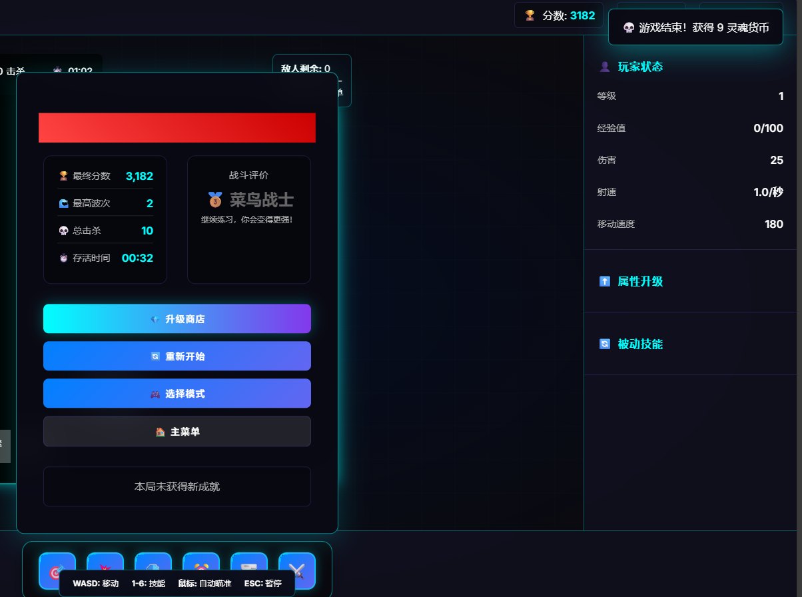
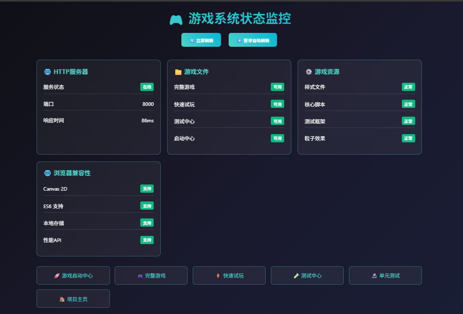

# 🚀 CYBER TOWER DEFENSE

[](https://github.com/username/tower-defense-game)
[](LICENSE)
[](https://github.com/username/tower-defense-game)

**欢迎来到科技塔防世界！** 使用WASD移动，数字键1-6释放技能，击败越来越大的敌人！

一个功能丰富的现代化塔防游戏，融合了经典塔防机制与创新的技能系统、永久升级、多游戏模式等特色。

## 📸 游戏截图

### 🏪 永久升级商店

*使用获得的灵魂货币永久提升你的能力！包含伤害强化、生存强化和特殊能力升级。*

### 🎮 游戏模式选择

*三种不同的游戏模式：闯关模式、无限模式和生存模式，满足不同类型玩家的需求。*

### ⚔️ 游戏战斗界面

*实时战斗场景，展示玩家角色、敌人、特效和完整的UI界面。*

### 📊 游戏结束统计

*详细的游戏统计数据，包括分数、波次、击杀数和存活时间。*

### 🛠️ 系统状态监控

*完整的系统状态监控，包括服务器状态、浏览器兼容性和性能检测。*

### 🎯 主菜单界面

*简洁现代的主菜单设计，提供快速开始、模式选择和游戏说明等功能。*

## 🎮 游戏特色

### 🎯 多种游戏模式
- **🗺️ 闯关模式**: 通过精心设计的关卡，每个关卡都有独特的挑战和奖励
- **♾️ 无限模式**: 挑战你的极限！坚持得越久，奖励越丰厚，敌人越强大
- **🛡️ 生存模式**: 保护你的基地，建造防御塔，抵御敌人的猛攻

### ⚡ 技能系统
强大的技能系统，数字键1-6释放不同技能：
- **🔥 火龙技能**: 召唤火龙造成范围伤害
- **⚡ 雷电攻击**: 连锁闪电攻击多个敌人
- **🧊 冰冻技能**: 减缓敌人移动速度
- **💫 时间扭曲**: 减缓时间流速获得战术优势
- **🌪️ 旋风攻击**: 360度范围攻击
- **🔮 能量护盾**: 临时无敌状态

### 💎 永久升级系统
使用灵魂货币进行永久性提升：
- **⚔️ 伤害强化**: 永久提升攻击力
- **❤️ 生存强化**: 增加生命值和防御力
- **✨ 特殊能力**: 解锁新的被动技能和特殊效果

### 🎵 沉浸式体验
- **🔊 完整音效系统**: 射击、爆炸、技能释放等音效
- **🎶 动态背景音乐**: 根据游戏状态变化的音乐
- **💥 视觉特效**: 粒子系统、爆炸效果、技能特效
- **📱 响应式设计**: 适配不同屏幕尺寸

## 🕹️ 操作方法

### 基础操作
- **WASD** - 移动玩家角色
- **数字键 1-6** - 释放对应的技能
- **鼠标点击** - 启用音效（首次游戏时）
- **ESC** - 暂停/返回菜单

### 技能快捷键
- **1** - 🔥 火龙技能 (伤害类型)
- **2** - ⚡ 雷电攻击 (连锁攻击)
- **3** - 🧊 冰冻技能 (控制类型)
- **4** - 💫 时间扭曲 (辅助类型)
- **5** - 🌪️ 旋风攻击 (范围攻击)
- **6** - 🔮 能量护盾 (防御类型)

## 🎯 游戏目标

### 短期目标
1. **🏆 通关各个模式**: 体验不同的游戏挑战
2. **💰 收集灵魂货币**: 用于永久升级系统
3. **⚡ 熟练使用技能**: 掌握技能组合和时机
4. **📈 提升个人记录**: 挑战更高的分数和波次

### 长期目标
1. **🌟 解锁所有升级**: 完全强化你的角色
2. **🥇 达成所有成就**: 完成游戏中的各种挑战
3. **🎮 掌握高级战术**: 成为塔防大师

## 🚀 快速开始

### 方式一：直接游戏
1. 在浏览器中打开 `index.html` 或 `game.html`
2. 选择你喜欢的游戏模式
3. 点击"🔊 启用音效"按钮（推荐）
4. 开始你的塔防之旅！

### 方式二：本地服务器（推荐）
```bash
# 启动游戏服务器
./start-game.sh

# 或者启动所有服务
./start-all-services.sh
```

然后访问：
- 🎮 **主游戏**: http://localhost:8000/game.html
- 📊 **游戏状态**: http://localhost:8000/game-status.html
- 🛠️ **系统监控**: http://localhost:8000/test-page.html

## 💡 高级游戏技巧

### 🎯 技能搭配策略
- **组合技能**: 先用冰冻减速敌人，再使用火龙或雷电造成大量伤害
- **时机把握**: 在敌人聚集时使用范围技能效果最佳
- **资源管理**: 合理分配技能冷却时间，避免关键时刻无技能可用

### ⚔️ 战斗技巧
- **保持移动**: 持续移动避免被敌人包围
- **利用地形**: 合理利用游戏场地的边界和障碍物
- **优先目标**: 优先攻击威胁较大的精英敌人
- **升级策略**: 根据当前模式选择合适的永久升级路线

### 🏆 模式专精
- **闯关模式**: 重点关注关卡特殊机制和Boss攻击模式
- **无限模式**: 注重持续输出和生存能力的平衡
- **生存模式**: 优先建造防御塔，合理分配防御资源

## 🛠️ 技术特性

### 🎮 游戏引擎
- **HTML5 Canvas**: 高性能2D渲染引擎
- **模块化架构**: 清晰的代码结构，易于维护和扩展
- **实时物理**: 碰撞检测和物理模拟系统
- **状态管理**: 完整的游戏状态管理系统

### 🎵 音视频系统
- **Web Audio API**: 专业音效处理
- **动态音乐**: 根据游戏情况动态调整背景音乐
- **粒子系统**: 华丽的视觉特效和爆炸效果
- **动画插值**: 流畅的角色和敌人动画

### 💻 技术栈
- **前端**: HTML5, CSS3, JavaScript (ES6+)
- **工具**: Vite, Jest, Node.js
- **兼容性**: 支持现代浏览器（Chrome, Firefox, Safari, Edge）
- **性能**: 60FPS流畅游戏体验，内存优化

### 📱 跨平台支持
- **响应式设计**: 自动适配不同屏幕尺寸
- **触控支持**: 移动设备触控操作（开发中）
- **本地存储**: 游戏进度和设置本地保存
- **离线模式**: 无需网络连接即可游戏

## 📁 项目结构

```
tower-defense-game/
├── 📜 game.html          # 主游戏文件
├── 📜 index.html         # 游戏入口页面
├── 📂 src/               # 源代码目录
│   ├── 📂 config/        # 游戏配置
│   ├── 📂 systems/       # 游戏系统
│   ├── 📂 modes/         # 游戏模式
│   └── 📂 utils/         # 工具函数
├── 📂 scripts/           # 特效和工具脚本
├── 📂 styles/            # 样式文件
├── 📂 tests/             # 测试文件
├── 📂 screenshots/       # 游戏截图
└── 📂 docs/              # 文档目录
```

## 🤝 参与贡献

我们欢迎任何形式的贡献！

### 🐛 报告问题
- 使用 [GitHub Issues](https://github.com/username/tower-defense-game/issues) 报告bug
- 提供详细的复现步骤和错误信息
- 包含浏览器版本和操作系统信息

### 💡 功能建议
- 在Issues中提出新功能建议
- 详细描述功能的使用场景和预期效果
- 考虑功能对游戏平衡性的影响

### 🔧 代码贡献
1. Fork 本仓库
2. 创建功能分支 (`git checkout -b feature/AmazingFeature`)
3. 提交改动 (`git commit -m 'Add some AmazingFeature'`)
4. 推送到分支 (`git push origin feature/AmazingFeature`)
5. 开启 Pull Request

## 📄 许可证

本项目基于 MIT 许可证开源 - 查看 [LICENSE](LICENSE) 文件了解详情。

## 🙏 致谢

- 感谢所有参与测试和反馈的玩家
- 特别感谢开源社区提供的工具和库
- 游戏音效和素材来源于免费资源库

---

**🎮 立即开始游戏，成为塔防大师！**

[](https://github.com/username/tower-defense-game)
[](https://github.com/username/tower-defense-game/releases)

*如果你喜欢这个游戏，别忘了给个 ⭐ Star！*