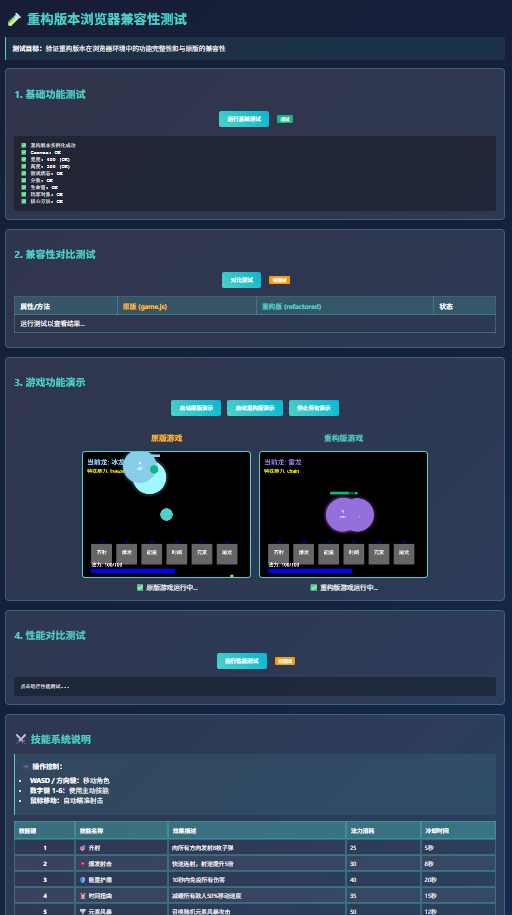

# 📸 游戏截图添加指南

## 🎯 目标
将您在聊天中分享的7张游戏截图正确保存到项目中，并在README中显示。

## 📋 截图清单

根据您提供的截图，需要保存以下文件：

### 1. 🛠️ 游戏系统状态监控界面
- **文件名**: `screenshots/system_status.png`
- **描述**: 深蓝色背景的系统监控页面，包含HTTP服务器、游戏文件、游戏资源、浏览器兼容性等状态信息
- **特征**: 右上角有"立即刷新"和"查看详细报告"按钮

### 2. 💎 永久升级商店界面  
- **文件名**: `screenshots/upgrade_shop.png`
- **描述**: 永久升级商店，显示灵魂货币：41，包含战斗强化、生存强化、特殊能力三个分类
- **特征**: 蓝色科技风格界面，有"伤害增幅"、"射速提升"、"暴击几率"等升级选项

### 3. 📊 游戏结束统计界面
- **文件名**: `screenshots/game_over.png`
- **描述**: 游戏结束页面，显示最终分数3182，最高波次2，总击杀10，存活时间00:32
- **特征**: 包含"升级商店"、"重新开始"、"选择模式"、"主菜单"等按钮

### 4. 🏠 游戏主菜单界面
- **文件名**: `screenshots/main_menu.png`
- **描述**: CYBER TOWER DEFENSE主菜单，包含选择模式、快速开始、游戏说明、新手教程等选项
- **特征**: 科技蓝色主题，底部显示游戏特色功能

### 5. ⚔️ 实时游戏战斗界面
- **文件名**: `screenshots/gameplay.png`
- **描述**: 游戏实时战斗画面，显示玩家(蓝色圆点)、敌人(橙色圆点)、技能特效
- **特征**: 左上角显示生命值、法力值，底部有技能栏(开科、雷电、能量、时间、元素、旋风)

### 6. 🎯 游戏模式选择界面
- **文件名**: `screenshots/game_modes.png`
- **描述**: 选择游戏模式弹窗，包含闯关模式、无限模式、生存模式三种选择
- **特征**: 每种模式都有详细说明和特色标签，底部有设置、统计、帮助按钮

### 7. 🧪 游戏测试页面界面
- **文件名**: `screenshots/test_page.png`
- **描述**: 基础版本测试兼容性检测页面，包含基础功能测试、兼容性测试、游戏功能演示等部分
- **特征**: 绿色测试通过状态，包含游戏演示的实际运行截图

## 💾 保存方法

### 方法一：手动保存（推荐）
1. 在聊天中右键点击每张截图
2. 选择"另存为" 
3. 导航到项目的 `screenshots/` 目录
4. 使用上面列出的确切文件名保存

### 方法二：使用脚本辅助
```bash
# 运行截图保存助手
./save-screenshots.sh

# 保存完成后更新README
./update-readme-images.sh
```

## 🔗 更新README

保存截图后，运行更新脚本：
```bash
./update-readme-images.sh
```

这将自动：
- ✅ 移除占位符图片链接  
- ✅ 添加实际截图文件链接
- ✅ 备份原始README文件
- ✅ 验证所有截图文件是否存在

## 📂 最终目录结构

```
screenshots/
├── system_status.png     # 🛠️ 系统状态监控
├── upgrade_shop.png      # 💎 永久升级商店  
├── game_over.png         # 📊 游戏结束统计
├── main_menu.png         # 🏠 游戏主菜单
├── gameplay.png          # ⚔️ 实时战斗界面
├── game_modes.png        # 🎯 模式选择界面
├── test_page.png         # 🧪 测试页面界面
└── README.md             # 📝 截图说明文档
```

## 🚀 提交到GitHub

截图保存完成后：
```bash
# 添加截图文件
git add screenshots/

# 更新README图片链接
./update-readme-images.sh

# 提交更改
git add README.md
git commit -m "📸 Add complete game screenshots

✨ Screenshots added:
- 🛠️ System status monitoring interface
- 💎 Permanent upgrade shop interface  
- 📊 Game over statistics interface
- 🏠 Main menu interface
- ⚔️ Real-time battle interface
- 🎯 Game mode selection interface
- 🧪 Test page interface

🎮 Now showcasing complete game experience!"

# 推送到GitHub
git push
```

## 🎨 GitHub显示效果

添加截图后，您的GitHub仓库README将显示：

### 📸 游戏截图展示
| 界面类型 | 截图预览 | 功能说明 |
|---------|----------|----------|
| 🛠️ 系统监控 |  | 游戏系统状态实时监控 |
| 💎 升级商店 |  | 使用灵魂货币永久提升能力 |
| 📊 游戏统计 |  | 详细的战斗数据和成就 |
| 🏠 主菜单 |  | 精美的科技风格主界面 |
| ⚔️ 实时战斗 |  | 激烈的实时战斗体验 |
| 🎯 模式选择 |  | 三种不同的挑战模式 |
| 🧪 兼容性测试 |  | 完整的功能测试验证 |

## ✅ 验证清单

- [ ] 保存了所有7张截图
- [ ] 文件名完全匹配要求
- [ ] 运行了 `./update-readme-images.sh`
- [ ] README中的图片链接已更新
- [ ] 提交了更改到GitHub
- [ ] 在GitHub上验证截图正常显示

## 🆘 故障排除

### Q: 截图在GitHub上不显示？
A: 检查文件路径和文件名是否完全正确，确保没有拼写错误。

### Q: 图片太大影响加载？
A: 可以使用图片压缩工具减小文件大小，推荐每张截图控制在500KB以内。

### Q: 想要更改截图？
A: 直接替换对应的PNG文件，然后重新提交即可。

---

**🎉 完成后，您的塔防游戏项目将拥有完整的视觉展示，大大提升GitHub上的项目吸引力！**
